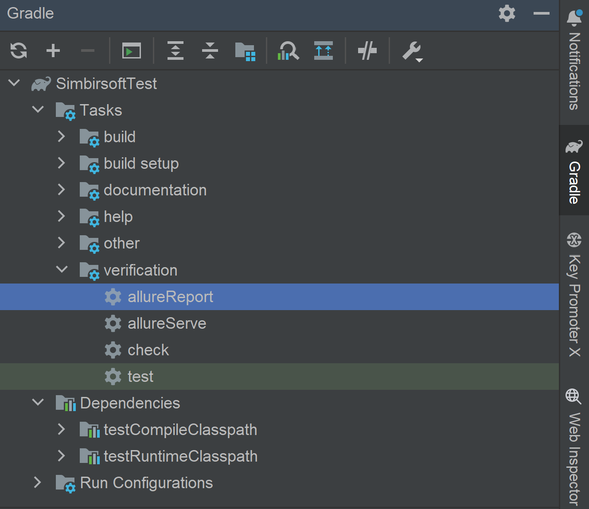

# Тестирование транзакций пользователя  globalsqa.com

- Тесты в данном проекте написаны на языке <code>Java</code> с использованием фреймворка для тестирования <code>Selenium</code>,
c применением паттерна Page Object.
- Сборщик - <code>Gradle</code>.
- <code>JUnit 5</code> задействован в качестве фреймворка модульного тестирования.
- В тестах включена возможность параллельного запуска через <code>Selenium Grid</code>. 
- В отчетах Allure для теста прикреплен csv файл с содержанием транзакций пользователя

## 🚀 Команда для запуска

Запуск с использованием Selenium Grid
```bash  
./gradlew -DuseRemote=true test
Для запуска необходимо предварительно запустить Selenium Grid
Адрес по умолчанию: "http://192.168.0.119:4444/wd/hub"
```
Локальный запуск
```bash  
./gradlew -DuseRemote=false test
Для запуска не забываем поменять адрес расположения вебдрайвера
По умолчанию: "C:\\webdrivers\\chromedriver.exe"

```
---
### 🖨️ Запуск Allure после окончания теста
<p align="center">

</p>

### 🖨️ Главная страница отчета

<p align="center">

</p>


